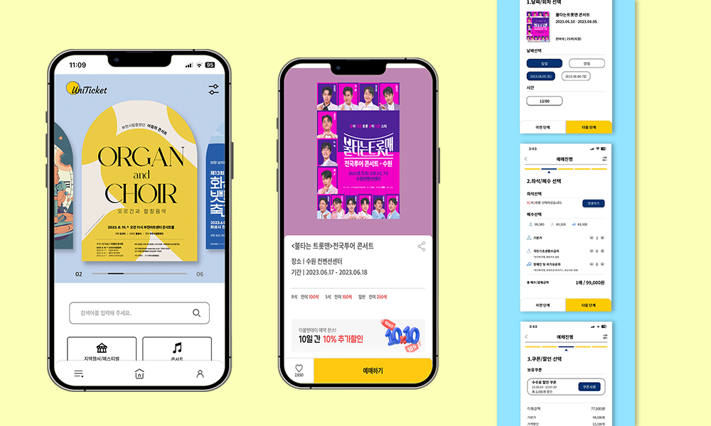

# 안녕하세요 신입 웹 프론트엔드 개발자 성해련 입니다.

<br>

### Uniticket 창작
### "모두를 위한 티켓팅 어플"

<br>



<br>

- Demo : http://rien.dothome.co.kr/portfolio/
  - 모바일 전용 페이지 입니다.

<br>

  - 팀 프로젝트
    - 담당 역할 : 로그인 및 회원관리(기여도 : 100%), 프론트엔드(기여도: 90%)

<br>

---

### 개발 목표
  - 모바일에 취약할 가능성이 있는 사용자들을 대표적인 타켓 고객층으로 설정하여 모든 사용자가 어려움 없이 하나가 되어 이용할 수 있는 티켓팅 서비스

  <br>

### 사용 기술
  - HTML
  - SASS
  - Jquery
  - PHP
  - Figma

  <br>

### 라이브러리
  - slick
  - cookie

  <br>

## Point

**Javascript animationend event를 이용하여 자연스러운 이벤트 연결 및 무한 반복 실행**

<br>

```javascript
function ani1() {
  document.getElementById('cursor').removeEventListener('animationend', ani1)
  document.getElementById('cursor').setAttribute('id', 'move')

  document.getElementById('move').addEventListener('animationend', ani2)
}

function ani2() {
  document.getElementById('move').removeEventListener('animationend', ani2)
  document.getElementById('move').setAttribute('id', 'cursor')

  document.getElementById('cursor').addEventListener('animationend', ani1)
}

document.getElementById('cursor').addEventListener('animationend', ani1)
```